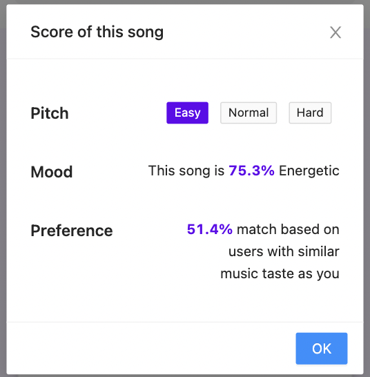
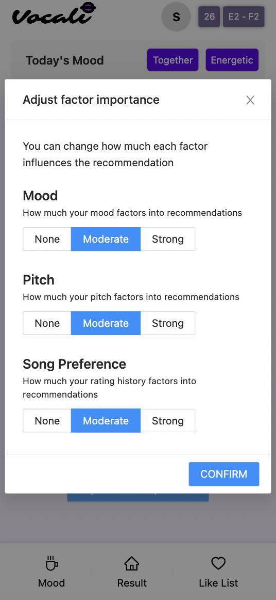
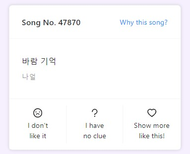
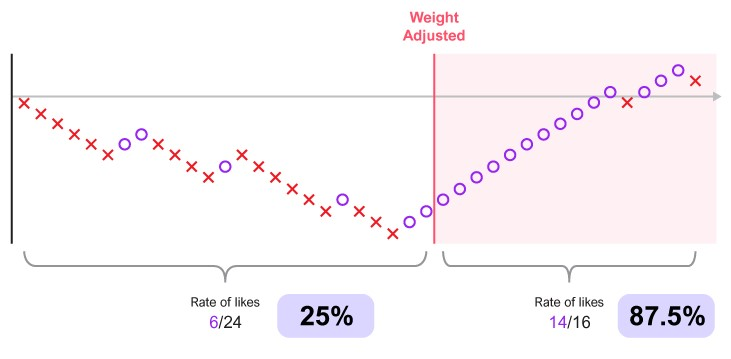
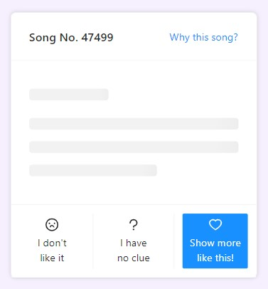

# CS492 Team Vocali - Final Report

2021 Spring, CS492 Human-AI Interaction

Link to Video: https://youtu.be/eLHXZRi-Bi4

## Members

* 20150645 Sungmin Im
* 20160832 Juhoon Lee
* 20170669 DaEun Choi
* 20203544 Seoyeon Jang

## Quality Arguments
Vocali delivers a ***flexible and autonomous*** song recommendation system for Noraebang users that apply ***multidimensional user data*** to recommend songs that the user would like to sing.

Many recommendation systems suffer from the lack of user agency in determining what and how the content is recommended. Often, users have no tools to affect their feed. This leads to users "gaming" the system by choosing or avoiding certain selections and queries, causing disinterest and frustration. 

Vocali gives the power to control their recommendations directly to the user through the ***transparency of its decision-making process***. Users are provided clear explanations via **Why This Song?** feature. The module shows for each song the pitch level (Easy, Normal, Hard) and percentage similarity to the mood and preference of other users. This explainability for every selection allows the user to draw an immediate connection between their input and the song. A user praised this feature commenting, “I like how it explains [the reason for recommendation], and how the channels were divided into multiple factors.”

*Fig 1. Example page of Why This Song explanation feature.*

More importantly, Vocali's core feature is that users are able to use this information to ***directly impact future recommendations with real-time feedback*** through the **Adjust Factor Importance** feature. The user can choose the influence strength of each factor (None, Moderate, Strong) if they feel that the model doesn't reflect their requests. When the user knows what they want, it is imperative that the recommendation system follows their needs. A user stated, "At first the mood didn't fit me, but after I changed the weight the results became much better."

*Fig 2. Example page of Adjust Factor Importance feature.*

On the other hand, the system surprises the user with ***choices that the user didn't realize they wanted***. The collaborative filtering method used for the song preference prediction model, despite having a rather small customized dataset, suggested songs that users had forgotten about but was pleasantly surprised to rediscover. A user expressed, "The recommended [song] isn’t something I listen to a lot but I know it well. I liked how it recommended songs that fit my taste [that I didn't remember]."

***Vocali uses robust information.*** It considers three factors: vocal range, mood/setting, and song preference. They are crucial when choosing Noraebang songs, which is more demanding than simply choosing songs for listening. Several users commended the availability of the pitch and setting options. Users can also give three different ratings for each song, providing detailed feedback to the model about their preference.

*Fig 3. Example page of song recommendation and ratings selection.*

Finally, the UI accentuates ***intuitive and swift design***. We considered the need for speed in choosing songs in Noraebang. Besides logging in, every action is a click/tap. We specifically designed the UI with ***phone interaction in mind***, as phones will be the primary access medium for our system. The color palette also shows drastic and consistent change when an option is selected.

Vocali is a Noraebang song recommendation system that provides the user with tools to directly influence their feed. With its robust factor incorporation and UI that enables quick feedback, it caters to each user with depth.

## Evaluation
We conducted a contextual inquiry with think aloud protocol with 6 participants recruited through school communities. We focused on receiving quality, mid-use feedback from each participant to gain detailed insight.

Majority of the users were avid Noraebang-goers, with an average score of 4.17 for how often they enjoy going to Noraebang for a 5-point likert scale. 5 out of 6 users rated 4 or greater. They had a general, but not advanced, knowledge of AI (avg=2.5).

Each session took around 30 minutes, with 5 minutes on system introduction and task explanation, 15 minutes on using the system with contextual inquiry, and 10 minutes on additional post interview. The users were instructed to use the system freely but asked to voice their thoughts out loud while browsing the system.

For the vocal range feature, many users found the feature innovative and one of the defining advantages of Vocali (P1, P4, P5, P6). They believed that vocal range was important domain-specific information that was missing when at Noraebang or from other recommendation systems. However, one of the users felt that the pitch information wasn't reflected well in the recommendation (P5).

For the mood feature, P4 felt that the mood choice very clearly affected the end recommendations. P6 "really enjoyed the **With Whom** feature" as it supported diverse settings and provided songs that fit each situation. However, they also felt that the 4 type of mood given were not wide enough to cover their range of moods.

For the song preference feature, most users felt that their preferences were reflected in depth (P2, P4, P6). Preference factors such as genre and year that the user skewed towards were noticeably seen in the recommendations (P4). However, some users hoped that the initial preset of 10 songs could have more selections or other features, such as song search (P3, P4).

After system exploration, each user selected three songs from system and then were told to score their satisfaction with the recommendation. The average score was 4.3 out of 5 points. Despite the limited number of songs in the dataset, the score demonstrated high user satisfaction with the recommendation provided by the system.

*Fig 4. User rating of three selected songs.*

Most users found **Why This Song** feature useful and easily understandable (P3, P4, P5). P3 especially used the feature extensively, and P4 was "very satisfied" with the explanations and thought "much deliberation went into the user's needs when building the system".

The users were also told to try the **Adjust Factor Importance** feature. While some users who had been overall satisfied with their recommendations before changing the weight showed little difference, those who had been unsatisfied saw a drastic improvement. For example, P4 had 6 out of 24 liked songs (25%) before they changed the mood weight, but afterwards liked 14 out of 16 songs (87.5%).

*Fig 5. Rating data of P4 before and after weight change.*

Some usability issues, such as songs that have already been rated showing up again with their rating specified, were reported.

## Discussion
Through the evaluation study of Vocali system, we observed informative behavior with respect to the interactions with a recommendation system. We have extracted the key points below.

**1. Recommendation as Machine-in-the-Loop System**

Recommendation systems are often considered machine-in-the-loop system, but in reality they are more human-in-the-loop where the user of the system has little influence beyond what content they choose or not to consume. Vocali aimed to create a tool where humans take the wheel in leading the model to the destination the user wants, *even if they don't know exactly what that may be*. 

We believe that Vocali users were able to conform the model to their needs even with the limitations of the prototype. The evaluation results showed that most users were able to understand how each factor contributed to the given recommendation even if they did not understand how the model worked in theory, which was demonstrated through their use of the **Adjust Factor Importance** feature. Users applied this function to 1) further refine their search or 2) steer the model on the right path in case of "wrong" recommendations. This interaction revealed how an AI model can be incorporated to allow users to actively control it without having to understand or reveal all of the underlying mechanisms.

**2. Importance of Visualization for Model Feedback and Explanation**

It is considered more explainability a model has, the better it is. The results showed that the quality and the presentation of the explanation has large influence on user understanding, perhaps arguably as much as the content of the explanation.

We observed that users seemed unfamiliar with recommendation explanations in general, especially in the style of factor importance. We concluded that explanations for the sake of model interpretability is less important in comparison to the explanations as a bridge to giving user control. In addition, how the system is explained, such as the wording and presentation of the explanation, played a large role in understandability. We may want to try diverse visualization methods or attempt more global interpretations in future versions of the system.

Also, visualization of model feedback had significant impact on the interaction quality. For example, the user should be able to know how many song ratings are required before the system reflects them in the new recommendations. We showed this with a "loading" delay in the system whenever the user's ratings updated the model, which we hoped would give a clear signal of when the model operates. However, we discovered that an explicit visualization change, such as with color or text, is required for the user. Also, even when the user did not like the recommendations, they instinctively felt that their feedback is being well-reflected. This suggests that we need to more carefully consider the visualization design to support the user's intuitive mental model of the system. The generation of such bidirectional real-time feedback from the user and the model promotes much more dynamic approach by the user to the system, furthering their interest and accesibility.

*Fig 6. "Loading" feeback when the model updates ratings information.*

## Individual Reflection
### Sungmin Im
* We worked as a great team, as everyone participated actively on all phases of the design project. Rather than strictly dividing each member's responsibility, our members didn't hesitate to help each other's work. Whenever we had any difficulties during the project, we were able to get help from the team members. It helped the members to keep motivated during the project, and made the work efficient and fast. There were some minor hurdles during the project. Some of our tasks were dependent on each other, so some of us had to wait for the others to finish the preceding tasks. This slowed down some part of the project, especially because we were working in an asynchronous manner. If I could change something about the teamwork so that I could do better next time, I think I might distribute the tasks such that they are less time-dependent on each other. For example, we can list all the tasks and first assign the tasks that could be done without any dependency. If the preceding tasks are finished, we can then start on the other tasks.

* I have learned that the users might not have the same understanding of the system as we do. We already know how the system works, and how to use it. Therefore, it was really difficult to predict how the users would interact with our product. Many of our expectations were different from reality, and we were only able to identify such difference from user tests. We have learned that it is very challenging to deliver our intention properly to the user, and it requires lots of iteration with the user to provide a good, interpretable UI. Also, we were surprised to realize that people build their mental model and interpretation on how the model works from expectation. For example, our model did not have a feature of whether the song is a solo song, a duet, or a group song. However, through our explanation and the model result, people thought that the model recommends songs based on such information. It means that actual model features and interpreted features do not have to be the exact same in terms of explanation.

### Juhoon Lee
* I was shocked by the ease of collaboration between the team members, despite the members working together for the first time. The dynamic was respectful yet efficient, and each person had a strong motivation and technical specialty that contributed to the final product. Each member was responsible for their own tasks, but always extended a hand to other members if they needed help. Also, we always discussed the reasons behind each design choice at every step, leading to a cohesive and well-thought-out final product. It felt like everyone was on the same page at all times, saving time and effort wasted on catching up. However, it was difficult at times to reconcile the different components of the system, especially when incorporating the AI models. I wish that the merging of the different components was done periodically rather than towards the end, so that we could have a better understanding of the overall workings and structure of the system to ensure that every part and their interactions are sound. Integration is also something that should be designed beforehand, not just the system architecture.
 
* I learned that even as a model designer, it is difficult to provide good explanations of the model to the users that they can understand *and* find helpful in using the system. It was also really interesting to design and implement a recommendation model for a fully-realized system, especially for such a specific task as Noraebang song selection. It required me to also design the model with human-AI interaction in mind - I found it intriguing that the considering user interaction could extend into the model itself. Also, I discovered that while subtle design factors can make or break the system, the users require very explicit and clear signals and feedback. It was important to reset my perspective on our system regularly to evaluate if the system evoked the same responses and expectations from the user. Also, model development for a web-based system was vastly more demanding, as database usage and *efficiency* was top priority for actual system use. I had to restructure my model to decrease its running time by several magnitudes, and it was a very instructive experience. The diversity of the software, languages, databases, and platforms used was also eye-opening for the complex architecture of a web-based system development.

### DaEun Choi
* Overall, I think that our team cooperated well with each other and produced great results. In particular, all of our team members had different experiences and skills. Therefore, we divided the development stage as design&frontend, backend, and model development, and each member was responsible for each of them. Because we worked in this way, I think we could achieve great efficiency by using our abilities in our own fields. This way can be lead to the situation that we may not know about other's work, but in our team, we prevent this by communicating almost every day, sharing situations, and providing solutions to each other. However, since we worked independently, I think the most challenging process was to combine each part into one system. Since each had different knowledge, it was necessary to understand each other's fields to know how to combine them. Because we didn't have enough time, we hurriedly connected each part through Internet searching. However, if we had enough time, I think it would be good to solve this challenge fundamentally by taking time to deeply share the technical contents of each other's parts.

* What I learned the most from this project is how to think from the user's point of view even when dealing with the technical field such as AI. In the general situation, I only focus on how to design the AI model to get the model with the highest accuracy. However, we didn't have ground truth in this project as it is a recommender system. Therefore, rather than accuracy, we focused more on how users can be more reliable about the model. We made various indicators so that users can fully understand the results, and added several interactions to let users adjust the model in any way they want. In this process, I got to experience something that I couldn't learn from general ML courses. Technically, it was great to learn a variety of platforms that can be used for quick web development. In my previous development experiences, I used the traditional frameworks as I had to make large complete services for a long time. In this project, I got to know a lot of Saas platforms that can be used in cases where prototypes need to be created quickly.

### Seoyeon Jang
* Our team successfully worked together with the passionate level of doing one’s job. One of the factors for active teamwork is that we decided the theme in which all members had an interest. We tried to share each other’s interests and hobbies at the first meeting and consider them to be the theme. The other point of success is the flexible boundary of the roles. Even though we divided the job, we actively participated in the other roles that are related. While I relied on front-end development considering the user-centered design and user testing, other team members gathered ideas of interaction together or helped front-end implementation. Also, I participated in data-collecting and idea-gathering of the model the other way around. Although there were almost no hurdles to overcome, I had to consider that I was the only member based on the design discipline. By participating in the overall process of deploying a web-based AI system, I realized that the developers focused more on realistic implementation while the designers focused more on user-side interaction. Therefore, I tried to bring up the interaction as a communication agenda when I felt our team focused too much on the implementation.

* The team-based design project experience made me think of the role of the designer in the human-AI interaction area. Because of the flexible boundary of the role in our team, it became an opportunity for me to consider the contemporary performance of the AI model not like the usual HAI research case focusing on futuristic user-centered interaction in my field. For example, we had to design the interaction for the target user who has a general level of knowledge at AI in current days and overcome the limitation of linear sum-up of three different categories of factors: the mood of Noraebang, the pitch calculation, and the preference of song at Noraebang. As a designer, it is important to balance between the level of implementation we could afford and the creative way of user-interaction for human-AI interaction projects. I recognized that the key factor for the balancing is the effort to keep in the role of designerly ways of thinking and active communication for the efficient understanding above the system. Also, I realized a certain level of knowledge in different areas, such as specific code or the library, made a big difference in fast communication and decision making from just briefly knowing the concept of AI. Especially learning a lot from DaEun who linked back-end and model to front-end design, I can have specific knowledge of implementation and a lesson of balancing skills as a designer for the future teamwork with developers.
