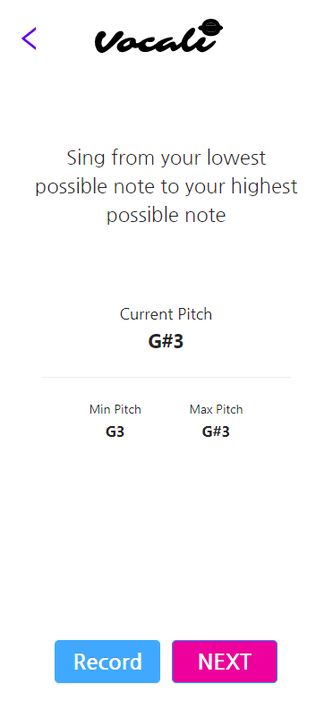
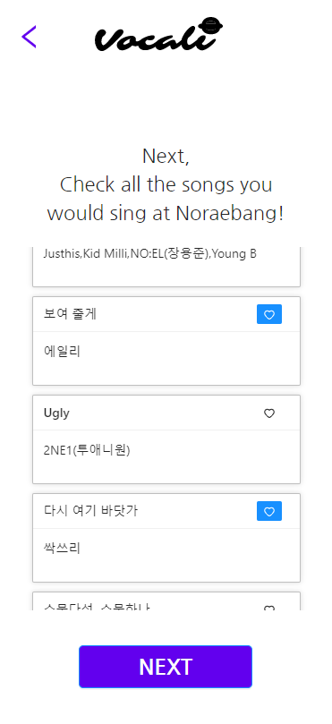
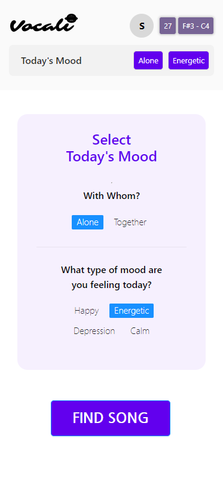
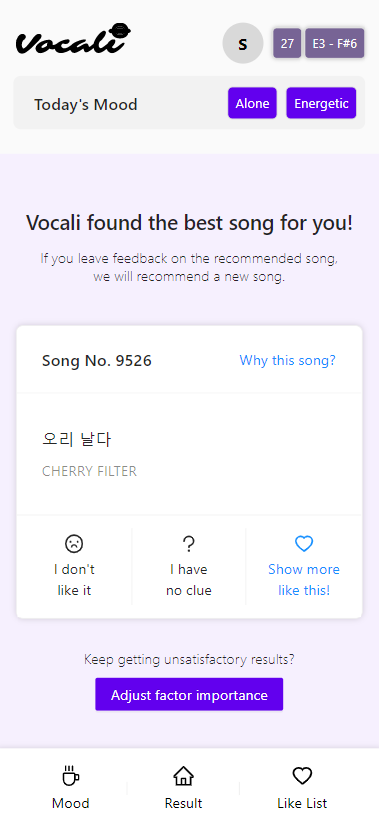
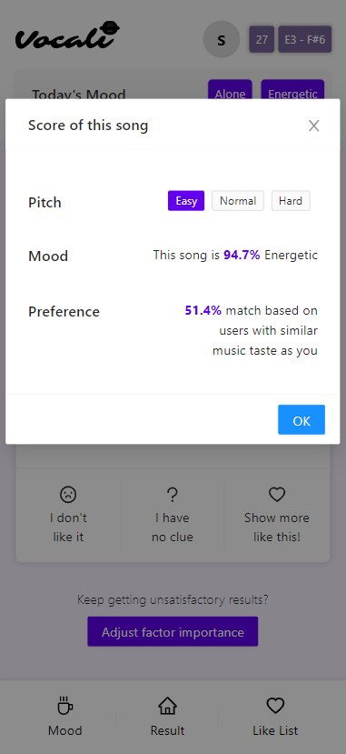
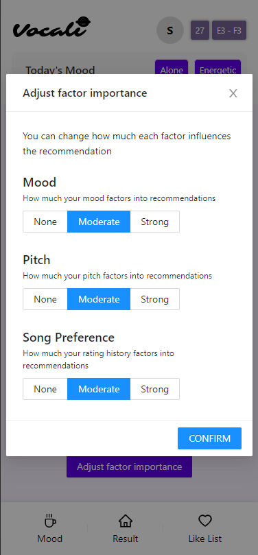

# CS492 Team Vocali - Prototype

## Members

* 20150645 Sungmin Im
* 20160832 Juhoon Lee
* 20170669 DaEun Choi
* 20203544 Seoyeon Jang

## Project Summary

People have trouble selecting songs to sing in Noraebang(Karaoke), especially when they are at the site. We propose Vocali, an interactive AI song recommendation system which utilizes user's vocal range, mood, and past singing experience to recommend the most appropriate songs for the day. Vocali provides interactive user interface to constantly receive and evolve from preference information directly from the user and lets the user modify the recommendation system itself to bring the best out of it, eventually providing the best recommendation experience for the user.

## Instruction
After logging in, you will be asked to perform several actions to receive your recommendation.

### Measuring Pitch

* Press the **RECORD** button on the bottom left to start recording your voice. *[Note: Please allow access to your microphone by the application and use the Chrome browser to get access notification]* Make sounds from your lowest to your highest note. Your minimum and maximum pitch will be recorded on the screen. When finished, press the **STOP** button.

### Choosing Initial Seed of Preferred Songs

* From the 10 songs in the list, choose all the songs you would like to sing at Noraebang by pressing the ♡ button on the top right corner of each song. You can choose as few or as many as you'd like.

### Selecting Mood

* Choose a 1. Group type **[Alone or Together]** and a 2. Mood type **[Calm, Depressed, Energetic, Happy]** based on your current setting and mood. You can return to this page and change the mood at any time by pressing the **Mood** tab at the bottom of the page.

Afterwards, you will receive your catered song recommendations.

### Viewing and Rating Song Recommendations

* Press the **Results** tab on the bottom of the screen to view your song recommendations.
* Using the pitch, song preference, and mood information given in the previous steps, your top song recommendation will be shown as follows.

* Choose whether you like or dislike the song by pressing **Show more like this!** or **I don't like it** button, respectively, or press **I have no clue** button in the middle if you don't know the song. A new top recommendation will appear afterwards based on your previous information and your recommendation ratings.

* You can also view explanations to why you received the recommendation by pressing the **Why This Song?** text on the top right corner. A modal will pop up showing the pitch difficulty, percentage of users with similar tastes as you liking the song, and percentage of how close the song is to the mood you selected.

### Adjusting Importance

* If you consistently unsatisfied with your results or simply wanting different recommendations, you can press the **Adjust Factor Importance** button on the bottom.

* Select how much you want each factor to affect your recommendation from **[None, Moderate, Strong]** options.

## Prototype Link
[https://janeseed.github.io/vocali-web/](https://janeseed.github.io/vocali-web/)

## Source Repository
Frontend: [https://github.com/Janeseed/vocali-web](https://github.com/Janeseed/vocali-web)
 Backend: [https://github.com/min0623/vocali-server](https://github.com/min0623/vocali-server)
 Model: [https://colab.research.google.com/drive/1wkziY5rmcnFXZKqMy-F2lulKpi_tPbQa?usp=sharing](https://colab.research.google.com/drive/1wkziY5rmcnFXZKqMy-F2lulKpi_tPbQa?usp=sharing)

## Libraries and Frameworks
### Frontend
#### Framework

* [Ant-Design](https://ant.design): for effectively connecting graphic & interaction design in Figma with front-end developing
* [React JS](https://reactjs.org)

#### Libraries
* [web-audio-daw](https://github.com/rserota/wad): recording user voice via microphone on browser

#### Deploy
* [Github Pages](https://pages.github.com)

### Backend
#### Framework
* [Kotlin](https://kotlinlang.org)
* [Spring Boot](https://spring.io/projects/spring-boot)

#### Database
* [PostgreSQL](https://www.postgresql.org)

#### Deploy
* [Heroku](https://www.heroku.com)

### Model
#### Mood analysis model
* [Spotipy](https://spotipy.readthedocs.io/): Python library for using [Spotify API](https://developer.spotify.com/documentation/web-api/). Getting features of each song, and playlist dataset for each moods.
* [Keras](https://keras.io/)
* [scikit-learn](https://scikit-learn.org/): for building linear regression model
* [pickle](https://docs.python.org/ko/3/library/pickle.html): for saving and loading model

#### Song preference model
* [surprise](http://surpriselib.com/): for additional feature creation with SVD matrix factorization
* [scipy](https://www.scipy.org/): for creating the sparse matrix
* [scikit-learn](https://scikit-learn.org/): for calculating cosine similarity and the MSRE error
* [XGBboost](https://xgboost.readthedocs.io/en/latest/): for creating the XGB regressor model

## Individual Reflection
### Sungmin Im
I have participated in building the backend server for our application. I provided REST API to the frontend, and built a medium server between our model server and the backend server.

We had to deal with model that had insufficient time performance to provide the user with realtime experience. We had to tackle this issue with various approach including UX-wise solution, and asynchronous connection with the model to fetch the recommendations in the background and push alarm the frontend when the calculation is finished.

It was my first time using Spring Boot with Kotlin, and constantly communicating with ML model. I have learned how to communicate with other teammates to provide them the appropriate APIs to make the system work, even when we are working remotely.

### Juhoon Lee
I was responsible for building the ML model based on the user's song preferences for the application. We debated on using content-based recommendation system at first, but in order to reduce the overlap with the mood model, decided on collaborative filtering. I thus developed a collaborative filering model with cosine similarity and XGB regressor model with custom-made rating data.

The biggest difficulty for collaborative filtering recommendation models was obtaining a good data set, which is especially important when handling cold start problems. Though small, we were able to collect a good quality data with custom selected songs with the help of others. Even with the improved data, learning how to build an ML recommendation model from scratch was challenging, such as tuning hyperparameters to obtain the best results.

I learned how to really consider the reason behind each step of creating the model. I struggled to understand how collaborative filtering was achieved at first, but I studied how it worked and went step-by-step. This made implementation easier and ultimately led to better performance and optimization. I now understand how I should study and use even complex systems and models for the future.

### DaEun Choi
In this project, I was mainly in charge of developing the ML model for recommending songs based on the user's mood and front-end development. For the ML model development, I collected the song dataset for each mood, processed it, and trained linear regression models for each mood. For front-end development, I mainly in charge of connecting APIs and dealing with compatibility issues.

The most difficult part was designing user interactions. Executing ML code inevitably results in a delay due to the large amount of computation. To avoid this delay affecting users, we couldn't deliver user feedback immediately into the model. However, we thought that applying feedback immediately and make consequential output is really important to help users to build proper mental model for our ML model. Therefore, designing appropriate user interactions between these two conflicting needs was very challenging.

In other courses, I learned that ML codes only take very few parts of ML development, but the most of the processes are collecting, processing, and cleaning data. I was able to actually experience this while working on this project. At first, I used very small amounts of unorganized data for building a model, and the performance was poor. This made me to struggle with the ML codes for a long time, but actually it was data that made the problem, not the codes. As such, I realized that the model is greatly influenced by the input training data, and that it is really important to collect, process and prepare data that matches with the purpose in the early stages of development.

### Seoyeon Jang
I have mainly contributed to design human-centered interaction. Planning user-experience that focused on the explanation of the model to non-expert users, I designed detailed pages and interaction with Figma and developed presentational code with react JS.

There were two types of difficulties I faced in this project. The first one was my limited ability at developing. It was hard for me to handle and utilize the components of graphics and interaction as I intended by developing because of my limited experience. The second one was dealing with matching user experience value to model performance. Like the other teammates mentioned, we have to match different needs between the users(fast exploration of good songs & figuring out the solution to adjust the result) and our models(getting feedback from the user to update performance & needs of time for a new calculation). We considered various interactions at an early stage such as showing 10 songs first and loading signals while the model reflects the feedback. However, we found a way to reduce calculation time on the model at the final, thinking that showing one song and reflecting the feedback immediately with the next one fits the natural mental model of users.

The most valuable skill I learned from this project is knowing how to communicate with developers as a designer considering the whole system with back-end and model. While participating in a part of developing the system, I could practice a more effective way of planning interactions and graphics considering the needs of engineers and also could learn how the whole system merged from front-end to back-end and model.

